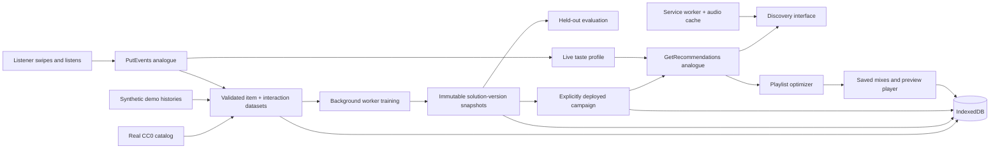

# Architecture and algorithms

## System

The browser owns all computation and persistence. There is no remote database or authenticated server. A static host serves the app; the local Node server is a development tool. The service worker caches the core files and 16 preview excerpts, supporting subsequent use when the host is unreachable. User-imported remote previews are not automatically available offline.

## Training

Positive LIKE, REPLAY and LISTEN histories produce a set of interacted items per user. Repeated interactions do not inflate distinct-user popularity or co-occurrence. SKIP does not contribute to positive training.

For items a and b:

`similarity(a,b) = positiveUsers(a ∩ b) / sqrt(positiveUsers(a) × positiveUsers(b))`

The popularity baseline stores only distinct positive-user counts. The hybrid model also stores item-to-item associations. A solution version captures its training events, recipe, creation time, event count and positive-user count. Later events cannot mutate its snapshot. Up to eight versions are retained; the deployed version is never removed by retention.

Training and evaluation run in a Web Worker and can be cancelled. A dataset revision check prevents accepting a model trained for an obsolete imported dataset. There is no artificial training delay or fabricated job status.

## Campaign lifecycle

The starter model v1 is pre-trained locally when a new session opens. Creating v2 leaves v1 serving. Only Deploy changes the campaign. Roll back deploys an earlier retained model. The campaign choice and models persist across reloads.

Import validates the entire replacement before mutation, clears models and campaign, and requires explicit training/deployment. Invalid data leaves the current session intact. This gives a visible dataset → train → evaluate → deploy → serve workflow.

## Live taste and ranking

Initial genre preferences contribute +1 per selected genre. Event weights are LIKE +1, REPLAY +1.5, LISTEN +0.25, SKIP −0.65. Positive per-item live weight is capped at 3. A latest SKIP removes an item from the positive live profile and eligible playlist candidates; a later LIKE reverses that rejection.

Signals:

- Genre affinity = clamp(0.5 + genreWeight / (2 × maxPositiveGenreWeight), 0, 1).
- Collaborative = weighted average similarity to positive-history tracks. A liked track has self-similarity 1 when eligible for a playlist.
- Popularity = distinct positive-user count divided by the catalog maximum.
- Mood fit = 1 − average absolute energy/valence distance from the preset. Balanced mood uses 0.5.
- Novelty = 1 − clamp(genreWeight / maxPositiveGenreWeight, 0, 1).

With taste/history, hybrid relevance = 0.42 affinity + 0.32 collaborative + 0.10 popularity + 0.16 mood fit. Cold start uses 0.75 popularity + 0.25 mood fit. Final score = (1 − discovery) × relevance + discovery × novelty. The default discovery feed uses 15% novelty. The popularity recipe ignores profile, mood and novelty to give a clear comparison.

Discovery excludes keep/pass decisions, but listening to a preview alone does not remove the current card. Content filtering is applied before ranking. Scores are deterministic heuristic values, not calibrated probabilities. Item IDs resolve ties.

## Playlist enhancement

Candidate eligibility uses current campaign, listener, mood and content filters. Previously liked tracks may be included; currently rejected tracks may not.

At each step, select the eligible track maximizing:

`(1 − discovery) × relevance + discovery × (0.5 × novelty + 0.5 × newGenreBonus)`

Eligibility enforces unique tracks, the remaining full-track duration budget and artist cap. The genre bonus changes after every selection. The algorithm may leave unused time and is not globally optimal.

Compare against (1) relevance-only selection under the same duration and artist limits, and (2) plain relevance ranking under the duration limit. This separates the contribution of the diversity objective from the artist constraint.

## Evaluation

For each eligible listener with at least three distinct positive items, hold out their last positive item. Remove all earlier occurrences of that item and all events at or after that listener's holdout timestamp. Train a fresh evaluation model on the remaining histories, request top-5 unseen items, and compare with popularity. Report Hit Rate@5 and NDCG@5.

This is a per-user holdout, not one global temporal cutoff. It evaluates the version's captured training history, not newer session events. The small catalog and synthetic seed histories limit interpretation; it is a reproducible functional evaluation, not a measured production uplift.

## Playback and persistence

Bundled previews are real excerpts; budgets use full source durations. The player logs LISTEN once after accumulating playback time (10 seconds or 70% for a shorter clip). Seeking does not add listening time. This remains a lightweight engagement heuristic, not proof of attentive listening. It does not auto-label a first play as REPLAY. Synthetic/imported histories may contain explicit replay events.

IndexedDB saves are serialized using snapshots to avoid older asynchronous writes overwriting newer state. Save failures produce a persistent warning. Restoring validates dataset and training snapshots and reconstructs models. User profiles are local identities, not authenticated accounts. Changing host/origin creates a separate storage context. Old v2 demo storage is not overwritten.

## AWS boundaries

The workflow and resource distinctions mirror Amazon Personalize's custom recommendation workflow. The implementation does not provision resources, reproduce AWS recipes or API schemas, simulate billing/autoscaling, use managed IAM, or claim AWS's performance guarantees. The CSV/schema examples are educational mappings. The local recipe names must not be presented as AWS recipe names.
