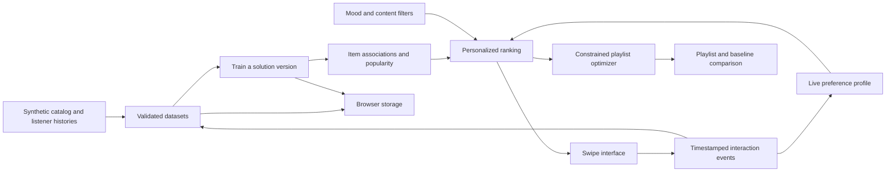

# Architecture and algorithms

## Local architecture

The website is static and can be served by GitHub Pages. A browser runs every computation and stores dataset and model-source snapshots locally. Model versions retain up to eight histories. There is no backend, AWS bill, server-side account or shared state. A simulated serving endpoint is a function call, not an AWS network request.

## Training

Positive LIKE and REPLAY events contribute to a per-user item history. For model associations, repeats collapse to presence per item; REPLAY contributes additional weight in the current user's live ranking, not additional co-occurrence users.

For items a and b:

`similarity(a,b) = users who positively interacted with both / sqrt(positiveUsers(a) × positiveUsers(b))`

Popularity is the number of distinct positive users per item. Training freezes these two structures for a version. New interactions affect them only after explicit retraining.

## Ranking

For the current listener:

- Genre feedback: LIKE +1, REPLAY +2, SKIP −0.7, summed by genre.
- Affinity: clamp(0.5 + genreWeight / (2 × maxPositiveGenreWeight), 0, 1).
- Collaborative score: weighted average trained similarity to positively interacted items.
- Popularity: distinct positive listeners divided by the catalog maximum.
- Mood fit: 1 minus the average energy/valence distance from the chosen mood; balanced uses 0.5.
- With history: relevance = 0.45 affinity + 0.35 collaborative + 0.10 popularity + 0.10 mood fit.
- Without history: relevance = 0.70 popularity + 0.30 mood fit.
- Novelty: 1 − clamp(genreWeight / maxPositiveGenreWeight, 0, 1).
- Discovery feed score = 0.80 relevance + 0.20 novelty.

Scores are heuristic ranking values, not calibrated probabilities. Ties resolve by item ID. The discovery feed excludes all previously interacted items. The playlist can include liked items but excludes any item that the listener has passed.

## Enhancement

The playlist optimizer repeatedly chooses the eligible candidate with highest marginal utility. The new-genre bonus is recalculated after each selection. Hard constraints are duration ≤ budget, tracks per artist ≤ cap, and unique tracks. The algorithm can leave unused time or return an empty playlist. It does not guarantee an optimal global objective.

## Evaluation and limitations

Chronological leave-one-item-out evaluation removes repeated occurrences of each held-out item for that listener. The trained model and candidate filter use only the remaining positive events. This is a simple offline test and not a production experiment. Fixture genre clusters intentionally make patterns visible. A larger diverse licensed dataset and real user study would be needed to judge usefulness.

## Difference from Amazon Personalize

Amazon Personalize is managed ML infrastructure; this implementation is a transparent teaching model. We simulate its major recommendation workflow, not every resource lifecycle, AWS model, autoscaling behavior, dataset minimum, scheduled update or API schema. JSON import is our convenience format. SKIP penalties and playlist optimization are application behavior. A faculty reviewer can inspect each algorithm and its mapping without a live AWS account.

## Resilience and privacy

Dataset imports check IDs, references, string sizes, feature ranges, event types and timestamps; unexpected fields are removed. Imported text is escaped before rendering. The importer rejects files over 5 MB, over 1,000 tracks or over 20,000 events. Invalid imports leave current data intact. Invalid saved data falls back to the demo with a notice. Storage failures show a notice rather than imply successful persistence. Model source snapshots permit reloading the same version without silently retraining it on newer events.
